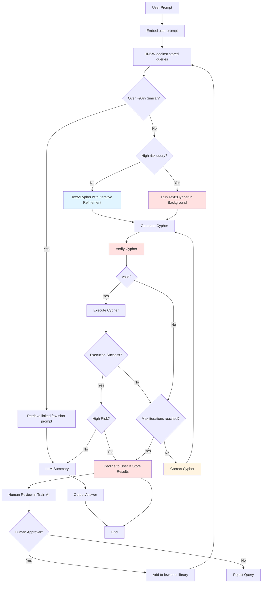

# BOOTH Retriever Architecture

## System Flow Diagram (Mermaid)

## Verification Techniques (in Iterative Refinement)

1. **Rule-Based Relation Direction**: Fast regex checks for correct relationship direction syntax
2. **CyVer-Based Verification**: Cypher syntax validation using CyVer library
3. **Execution-Based**: Try executing against database (slower but accurate)
4. **LLM-Based**: Use LLM to validate if Cypher matches intent (slowest, most comprehensive)

## Correction Techniques

1. **Rule-Based**: Fix common relation direction errors automatically
2. **LLM-Based**: Use LLM to correct Cypher based on verification feedback

## Key Components

- **`src/booth_orchestrator.py`**: Main workflow controller with iterative refinement loop
- **`src/cypher_verification.py`**: Verification techniques for Cypher validation
- **`src/cypher_correction.py`**: Correction techniques for Cypher refinement
- **`src/llm_client.py`**: OpenAI integration for embeddings, generation, and correction
- **`src/neo4j_client.py`**: Neo4j operations and Cypher execution
- **`app.py`**: Streamlit query interface
- **`pages/1_Train_AI.py`**: Human curation interface (Train AI page)

## High-Risk Query Handling

When a query is marked as high-risk:
1. The query is declined to the user (results not shown)
2. The full text2cypher pipeline runs in the background
3. All attempts, results, and summaries are stored in Neo4j
4. Curators can review what would have happened in the Train AI page
5. Safe queries can be approved to become few-shot examples

## Stop Criteria

- Max 3 iterations (configurable)
- Early stop if valid Cypher is generated and executes successfully

