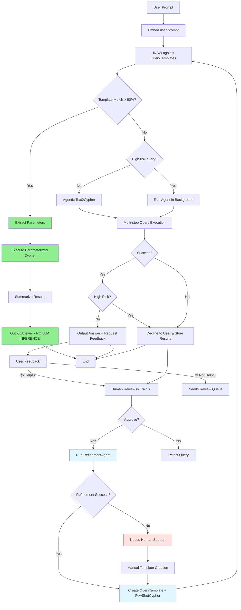

# BOOTH Retriever Architecture

## System Flow Diagram (v2 - Parameterized Templates)



## Instant Execution Path (Green)

When a QueryTemplate matches the user's question:
1. **No LLM inference needed** for query generation
2. Parameters extracted from question
3. Pre-approved Cypher executed directly
4. Only LLM call is for summarizing results

## Key Components

- **`src/booth_orchestrator.py`**: Main workflow controller with template matching + agentic fallback
- **`src/agents/agentic_retriever.py`**: Deep Agent for multi-step graph exploration
- **`src/agents/refinement_agent.py`**: Agent that consolidates multi-step queries into parameterized templates
- **`src/llm_client.py`**: OpenAI integration for embeddings, generation, and summarization
- **`src/neo4j_client.py`**: Neo4j operations, template storage, and Cypher execution
- **`app.py`**: Streamlit query interface
- **`pages/1_Train_AI.py`**: Human curation + refinement interface

## Data Model (v2)

See `docs/data_model.md` for full schema documentation.

### Node Types
- **`UserQuestion`**: Individual user questions with embeddings
- **`QueryTemplate`**: Parameterized question patterns (e.g., "What {attribute} did {person} hold?")
- **`FewShotCypher`**: Approved parameterized Cypher queries
- **`CypherAttempt`**: Audit trail of Cypher attempts
- **`Response`**: Query results and summaries

### Key Relationships
```
(UserQuestion)-[:SIMILAR]->(QueryTemplate)-[:FEW_SHOT_EXAMPLE]->(FewShotCypher)
(UserQuestion)-[:INSTANCE_OF]->(QueryTemplate)  // when approved
(FewShotCypher)-[:REFINED_FROM]->(UserQuestion)  // audit trail
```

## Refinement Workflow

When a query is approved:

1. **RefinementAgent** analyzes the multi-step queries that were executed
2. **Consolidates** them into a single optimized Cypher query
3. **Parameterizes** entity names (e.g., `$person_name`, `$film_title`)
4. **Tests** that the refined query produces the same answer
5. **Auto-categorizes** the question type
6. **Creates** `QueryTemplate` + `FewShotCypher` nodes

If refinement fails after 5 attempts → **Needs Human Support** queue

## Question Categories

Auto-assigned categories for QueryTemplates:

| Category | Example |
|----------|---------|
| `PERSON_ATTRIBUTE` | "What nationality was X?" |
| `PERSON_ROLE` | "What position did X hold?" |
| `WORK_CREATOR` | "Who directed X?" |
| `WORK_PARTICIPANT` | "Who starred in X?" |
| `LOCATION_COMPARISON` | "Are X and Y in the same city?" |
| `LOCATION_ATTRIBUTE` | "Where is X headquartered?" |
| `TEMPORAL` | "When was X founded?" |
| `RELATIONSHIP` | "How is X related to Y?" |
| `MULTI_HOP` | "What university did the director of X attend?" |

## High-Risk Query Handling

When a query is marked as high-risk:
1. The query is declined to the user (results not shown)
2. The agentic pipeline runs in the background
3. All attempts, results, and summaries are stored in Neo4j
4. Curators can review in the Train AI page
5. Safe queries can be approved → triggers refinement workflow

## Performance Benefits

With the parameterized template system:
- **Similar questions** → Instant execution (no LLM query generation)
- **Parameter extraction** → Single fast LLM call
- **Summarization** → Single LLM call for results
- **Total: 2 LLM calls** vs **5-10+ calls** for agentic exploration

